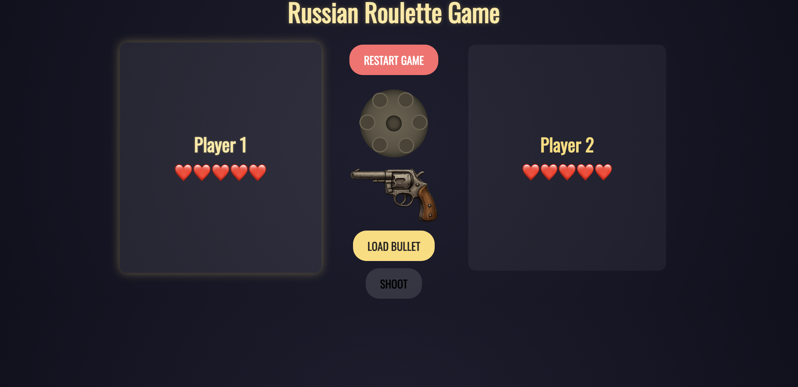

# 🔫 Russian Roulette – The Ultimate 2-Player Showdown

A tense, browser-based **Russian Roulette** game built with pure HTML, CSS, and JavaScript.  
One bullet. Six chambers. Two players. No mercy.

Will you pull the trigger... or pass it to your friend?

## ✨ Live Demo

Play it right now → [https://GiChirico.github.io/russian-roulette](https://gichirico.github.io/roulettegame/)

## 🎮 How to Play

1. Player 1 starts.
2. Click **"Load Bullet"** – a single bullet is randomly placed in one of the 6 chambers (you’ll never know which one).
3. Click **"Shoot"** – point the gun at your own head.
   - 🔫 **BANG!** → You lose one life (❤️) and the it's time for the other player to test their luck.
   - ✅ **Click** → Empty chamber! The gun passes to the other player.
4. First player to run out of lives loses. The survivor wins! 

## 🖼️ Features

- Beautiful spinning revolver animation
- Dramatic sound effects not included… yet (your imagination works fine)
- Smooth player switching with gun flip
- Lives displayed as big red hearts ❤️
- Winner celebration styling
- No dependencies – just vanilla JS!
